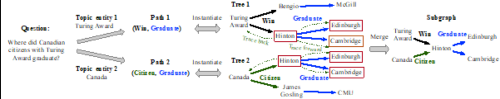
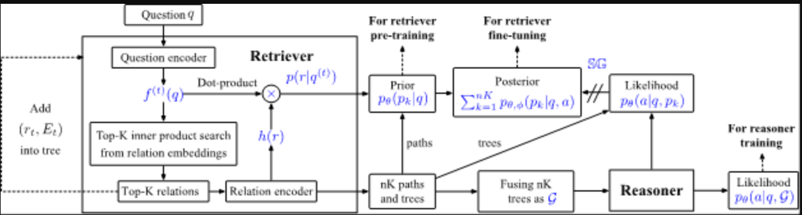
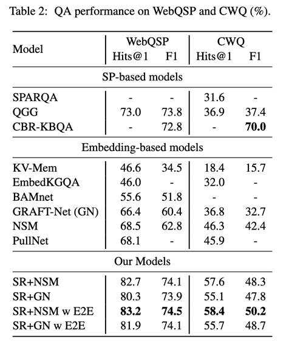

# 【关于 子图检索增强的知识图谱问答方法】 那些你不知道的事

> 作者：杨夕
> 
> 项目地址：https://github.com/km1994/nlp_paper_study
> 
> 论文：Subgraph Retrieval Enhanced Model for Multi-hop Knowledge Base Question Answering
> 
> 会议：ACL2022
> 
> 链接：https://github.com/RUCKBReasoning/SubgraphRetrievalKBQA/tree/main/paper
> 
> 代码：https://github.com/RUCKBReasoning/SubgraphRetrievalKBQA
> 
> 个人介绍：大佬们好，我叫杨夕，该项目主要是本人在研读顶会论文和复现经典论文过程中，所见、所思、所想、所闻，可能存在一些理解错误，希望大佬们多多指正。

## 一、摘要

Recent works on knowledge base question answering (KBQA) retrieve subgraphs for easier reasoning. A desired subgraph is crucial as a small one may exclude the answer but a large one might introduce more noises. However, the existing retrieval is either heuristic or interwoven with the reasoning, causing reasoning on the partial subgraphs, which increases the reasoning bias when the intermediate supervision is missing. This paper proposes a trainable subgraph retriever (SR) decoupled from the subsequent reasoning process, which enables a plug-and-play framework to enhance any subgraph-oriented KBQA model. Extensive experiments demonstrate SR achieves significantly better retrieval and QA performance than existing retrieval methods. Via weakly supervised pre-training as well as the end-to-end fine-tuning, SRl achieves new state-of-the-art performance when combined with NSM, a subgraph-oriented reasoner, for embedding-based KBQA methods.

- 背景：最近关于知识库问答 (KBQA) 的工作检索子图以便于推理。 
- 动机：
  - 所需的子图至关重要，因为小的子图可能会排除答案，但大的子图可能会引入更多噪声。
  - 然而，现有的检索要么是启发式的，要么与推理交织在一起，导致对部分子图的推理，在缺少中间监督时增加了推理偏差。
- 论文方法：本文提出了一种与后续推理过程分离的可训练子图检索器（SR），它使即插即用框架能够增强任何面向子图的 KBQA 模型。 
- 实验结果：与现有检索方法相比，SR 取得了显着更好的检索和 QA 性能。 通过弱监督的预训练以及端到端的微调，SRl 与 NSM（一种面向子图的推理器）相结合，用于基于嵌入的 KBQA 方法，实现了新的最先进的性能。

## 二、背景知识

知识图谱问答致力于基于百科知识图谱数据回答客观事实问题。

- 目前的两种主流方法：
  - 语义解析法：
    - 介绍：着眼于将自然语言问题解析为诸如 SPARQL 之类的逻辑表达式
    - 缺点：会过度依赖于标注的逻辑表达式
  - 表示学习法：
    - 介绍：直接对图中的实体进行表示和排序。
    - 优点：在这类方法中，从全图中先抽取问题相关的子图，再在子图上推理答案的表示学习方法表现出显著的优势。

## 三、论文动机

- 子图的质量极大地影响整体问答的效果：
  - 子图太小极其容易漏掉答案
  - 太大又会引入过多的噪音
- 已有工作例如 PullNet ：
  - 思路：提出对子图检索模块进行训练，以提升检索到子图的质量。
  - 缺点：其检索与推理模块是交织在一起进行的。具体来说，在每一步中，检索器选择与问题相关的知识图谱关系，同时推理器推理决定该关系的哪个尾实体需要被扩展到子图中。检索与推理的交织导致推理器的训练和推理过程都需要在中间不完整的子图上进行。由于中间子图的监督信号通常是缺失的，不完整子图上的推理会增加偏差，影响到最终推理的效果。

## 四、论文方法

1. 子图增强的知识图谱方法

- 核心思想：子图检索模块与推理模块是**解耦**的。
- 思路：
  - 子图检索器被设计为一个高效的双编码器，通过自动扩展路径的方法来归纳子图；
  - 当检索得到子图后，任何面向子图的知识图谱问答模型都可以应用到该子图上进行答案推理。
- 优点：**解耦合的设计使得推理仅在完整的子图上进行，并且提供了一个可插拔的框架来支持任何面向子图的推理器**。

> 图 1 子图检索过程。给定问题和主题实体，从主题实体开始扩展路径，由路径归纳树，最后将扩展自不同主题实体的树合并为图。

2. 检索器 训练

- 采用弱监督训练：
  - 无监督训练的方式：采用主题实体与答案之间的最短路径作为近似监督信号。无监督采用关系抽取的数据集来构建问答伪标签
  - 端到端训练的方式：
    - 核心思想是利用推理器的反馈指导路径的扩展。
- 尽管两个模块是联合训练的，但推理始终在整个子图上进行。图 2 展示了整个训练的过程。

> 图 2：子图检索器的训练过程。给定问题，子图检索器抽取 nK 条路径。首先基于每条路径的先验概率预训练子图检索器，然后基于路径融合产生子图的似然概率训练推理器。最后进行端到端训练时，检索器基于每条路径的后验进行微调，其中后验概率包含先验概率和私然概率。

## 五、论文实验

在 2 个公开数据集 WebQSP 和 CWQ 上进行了实验，结果表明：

1. 将提出的子图检索器结合经典的图推理器模型 NSM，在知识图谱问答上取得新的最佳效果；
2. 为得到相同的答案覆盖率，提出的子图检索器能够产生更小的子图并得到更优的问答效果；
3. 无监督预训练搭配 20% 的弱监督信号能够媲美全部弱监督训练；
4. 端到端微调能够同时提升检索器与推理器的效果。

## 参考

1. [论文浅尝 - ACL2022 | 子图检索增强的知识图谱问答方法](https://mp.weixin.qq.com/s?__biz=MzU2NjAxNDYwMg==&mid=2247496637&idx=1&sn=f33a4fe4c69e8852e1487383a40fb2cb&chksm=fcb05458cbc7dd4ed03c8fe1ab3a7b38bb2d3b3451a02be2154493064b08654ae3e422929ec7&mpshare=1&scene=22&srcid=0518KFwBdYyb0ZjCnP2BV8St&sharer_sharetime=1652873644959&sharer_shareid=453d0c33923605be2d4739fda94822f7#rd)
2. [SubgraphRetrievalKBQA github](https://github.com/RUCKBReasoning/SubgraphRetrievalKBQA)