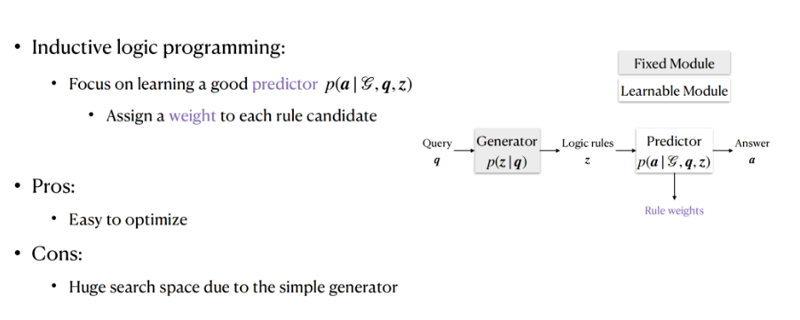

# 【关于 基于逻辑规则的图谱推理 RNNLogic 】 那些你不知道的事

> 作者：杨夕
> 
> 论文：RNNLogic: Learning Logic Rules for Reasoning on Knowledge Graphs
> 
> 论文地址：
> 
> 论文出处：
> 
> 项目地址：https://github.com/km1994/nlp_paper_study
> 
> NLP 面经地址：https://github.com/km1994/NLP-Interview-Notes
> 
> 推荐系统 百面百搭：https://github.com/km1994/RES-Interview-Notes
> 
> 个人介绍：大佬们好，我叫杨夕，该项目主要是本人在研读顶会论文和复现经典论文过程中，所见、所思、所想、所闻，可能存在一些理解错误，希望大佬们多多指正。

## 一、动机

- 介绍：知识图谱可以看作是我们真实世界中的一些事实的集合，每一条事实可以表示成（h,r,t）或者r(h,t)的形式。

> eg：比尔盖茨是微软公司的创始人 -》 （Bill Gates, co-founder of, Microsoft）的3元组组成的事实

- 知识图谱应用价值：
  - 推荐系统中，知识图谱可以帮助我们更好地挖掘用户的兴趣；
  - 药物再利用方面，对于药物的属性、疾病的属性以及药物和疾病之间关系的已有信息，可以帮助我们去发现新的药物和疾病间的联系，从而更好地去对抗疾病。

- 存在问题：
  - **图谱信息是不完全的**，而补全图谱的人工成本又是非常巨大的，尤其是像是一些医药、金融等一些特定的领域。如果还要考虑知识的动态更新的话，就更加大了图谱补全的难度。

## 二、介绍

- 关系预测（知识图谱推理）：给定已有图谱，去推理出图谱中的一些缺失的边。比如上图，我们希望能推出红色的边（詹姆斯出生在巴黎）。

## 三、常用方法介绍

### 3.1 图谱表示法

- 基本思想：把每一个实体或者关系做向量嵌入，通过这些向量表示来进行推断找到缺失的边。

- 优点：通常能有较好的预测效果。
- 缺点：模型缺乏可解释性。

### 3.2 归纳逻辑编程法

- 基本思想：给定已有的知识图谱，可以从知识图谱里面提取出一些通用逻辑规则（eg：出生地（born in）和城市（city of）两个关系可以用来推断国籍（nationality）），再反过来去做关系预测。通过这样的方式，可以使得模型的可解释性更强，而且生成的规则也具有更好的可泛化性。

- 概率形式建模任务 介绍：【归纳逻辑编程（Inductive logic programming）】
  - 生成器（generator）：生成逻辑规则
  - 预测器（predictor）：将利用生成的规则和已有的图谱去预测最后的答案

- 核心：学到一个好的预测器，然后在具体在操作的过程中，他们会利用一个**固定的生成器（比如一套逻辑规则的模板）生成出大量的潜在逻辑规则，在预测阶段会给每个潜在的逻辑规则一个权重（weight），最后从所有的逻辑规则里面挑选权重大的规则，当作学习到的比较重要的规则**。

- 优点：整个框架的优化比较简单。
- 缺点：对规则的搜索空间大，因为固定的生成器。如果想要得到比较好的结果就要尝试大量的逻辑规则，导致效率较低。

### 3.3 基于强化学习的方法

- 基本思想：直接去学习一个生成器，给定一个查询（Query）后可以直接生成一个规则，一旦有了这个规则之后，就可以根据规则定义的关系在知识图谱上去做随机游走，得到我们想要的答案。在这个框架里，只有生成器是可以学习的，预测器是相对简单的，固定的

- 优点：预测搜索效率高
- 缺点：整个框架的优化很难；依赖KGE（图谱嵌入）的方法来做激励调整。

## 四、逻辑规则学习方法 RNNLogic 方法介绍

### 4.1 研究背景

在对上面两个方法对比时，我们发现一个方法侧重在学习生成器，另一个侧重学习预测器。我们希望有一种框架，可以同时训练生成器和预测器，也就是RNNLogic的一个核心点。

### 4.2 RNNLogic 方法介绍

### 4.2.1 研究点 1：链式的逻辑规则

- 思路：可以将链式的逻辑规则变成一个关系序列，其中用END来表示结尾。那很自然的，可以通过LSTM来生成这些不同的链式逻辑规则，并输出每一条逻辑规则的概率，进而得到一个弱逻辑规则的集合

### 4.2.2 研究点 2：随机逻辑编程（stochastic logic programming）

- 思路：
  - 会通过生成器的弱关系集合进行游走，如图中所示的两种关系链：
    - 第一种可以得到France这个答案；
    - 第二个逻辑规则可以得到France，Canada和US三个答案。
  - 对于每个潜在答案，我们可以给它定义一个分数，也就是到达这个实体的逻辑规则的weight的和。
  - 最后就可以根据分数得到每种答案的概率，挑选出那些概率最大的来当成我们最终的答案。

### 4.2.3 研究点 3：优化方法

- 动机：因为无论是生成器还是预测期，都是动态学习的，所以优化起来可能会有一定难度。而我们发现生成器和预测器两者的难度是不同的，前者由于对后者的依赖，使得生成器是需要依赖于预测器的结果来进行动态调整的，所以生成器会更难些。
- 思路：

1. 给定了一个生成器生成了一些逻辑规则送给预测期，让预测器给生成器反馈这个逻辑规则的集合是好还是坏。我们的思路是希望预测器给生成器的反馈更加具体，譬如哪几条规则更重要，从而帮助生成器更好地去更新，得到更好的结果。
2. 整个优化的过程可以如下表示

- 步骤

1. 给定一个查询（Query），让生成器生成很多逻辑规则，再把逻辑规则和知识图谱同时送到预测器里面，去更新预测器，最大化生成正确答案的概率；
2. 从所有生成的这些逻辑规则里面去挑选出那些最重要的逻辑规则。这里我们通过使用后验推断的方法来计算每一条弱的逻辑规则的后验概率进行挑选。因此，在整个过程中，每一条弱的规则概率是由生成器来提供的，似然函数由预测器来提供。这样结合两者共同的信息来得到一个比较重要的逻辑规则；
3. 把找到的高质量的逻辑规则当成训练数据，送回生成器去学习；

## 参考

1. [基于逻辑规则的图谱推理](https://mp.weixin.qq.com/s?__biz=MzU1NTMyOTI4Mw==&mid=2247570917&idx=1&sn=710d540636b1487f51b4d60613a81de9&chksm=fbd66789cca1ee9f0f8f45b200e148e76c009a5eac2ef69586552be3c7395cd3696937288847&mpshare=1&scene=22&srcid=0513k94qZdMEYZGiOwRUduZP&sharer_sharetime=1652435502890&sharer_shareid=453d0c33923605be2d4739fda94822f7#rd)

